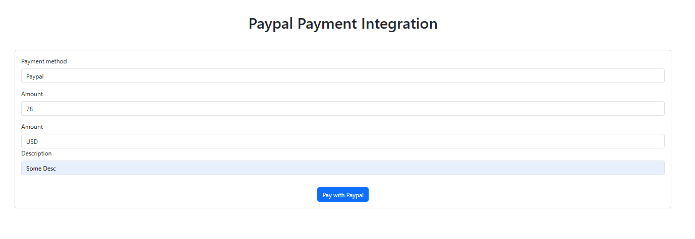
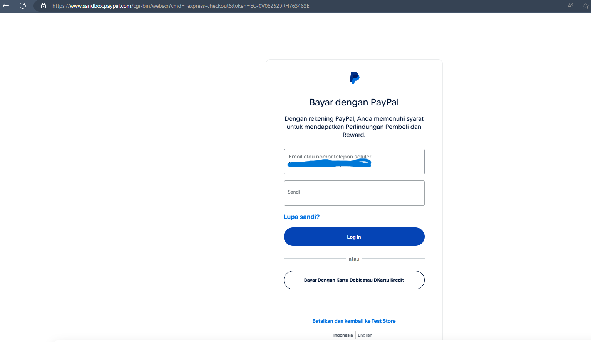
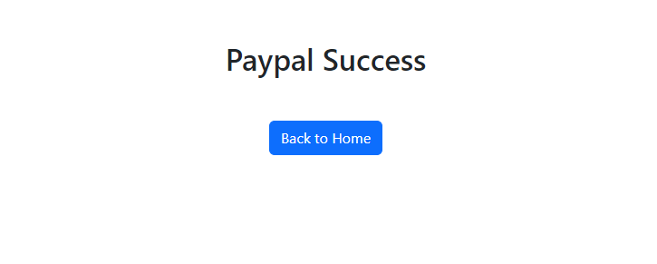
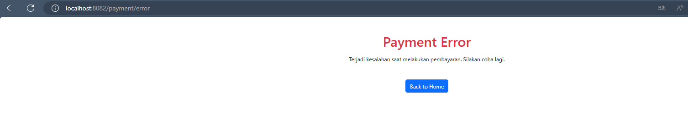

````markdown
## Getting Started

To get started with this project, follow the steps below:

1. **Clone the Repository**

   ```sh
   git clone https://github.com/hendrowunga/Paypal-Integration-SpringBoot.git
   cd Paypal-Integration-SpringBoot
   ```
````

2. **Setup the Project**

   Ensure you have [Java](https://www.oracle.com/java/technologies/javase-downloads.html) and [Maven](https://maven.apache.org/download.cgi) installed. You can check this by running:

   ```sh
   java -version
   mvn -version
   ```

3. **Build the Project**

   Run the following command to build the project:

   ```sh
   mvn clean install
   ```

4. **Run the Application**

   Start the Spring Boot application using Maven:

   ```sh
   mvn spring-boot:run
   ```

5. **Access the Application**

   Open your browser and navigate to `http://localhost:8082` (or the port you have configured in `application.yml`).

## Reference Documentation

For further reference, please consider the following sections:

- **[Official Apache Maven documentation](https://maven.apache.org/guides/index.html)**: Comprehensive guide on Maven usage and configuration.
- **[Spring Boot Maven Plugin Reference Guide](https://docs.spring.io/spring-boot/docs/current/maven-plugin/reference/html/)**: Details on how to use the Maven plugin for Spring Boot.
- **[Create an OCI image](https://docs.spring.io/spring-boot/docs/current/reference/htmlsingle/#howto-create-a-docker-image)**: Instructions on creating Docker images for your Spring Boot application.
- **[Spring Web](https://docs.spring.io/spring-boot/docs/current/reference/htmlsingle/#web)**: Documentation on building web applications with Spring Boot.
- **[Thymeleaf](https://www.thymeleaf.org/documentation.html)**: Documentation on using Thymeleaf as a templating engine with Spring Boot.

## Guides

The following guides illustrate how to use some features concretely:

- **[Building a RESTful Web Service](https://spring.io/guides/gs/rest-service/)**: A step-by-step guide on building a RESTful web service with Spring Boot.
- **[Serving Web Content with Spring MVC](https://spring.io/guides/gs/serving-web-content/)**: A guide on serving web content using Spring MVC.
- **[Building REST services with Spring](https://spring.io/guides/gs/rest-service/)**: Instructions for building RESTful services using Spring.
- **[Handling Form Submission](https://spring.io/guides/gs/handling-form-submission/)**: Guide on handling form submissions in a Spring Boot application.

## Output

Below are some screenshots of the project in action:





